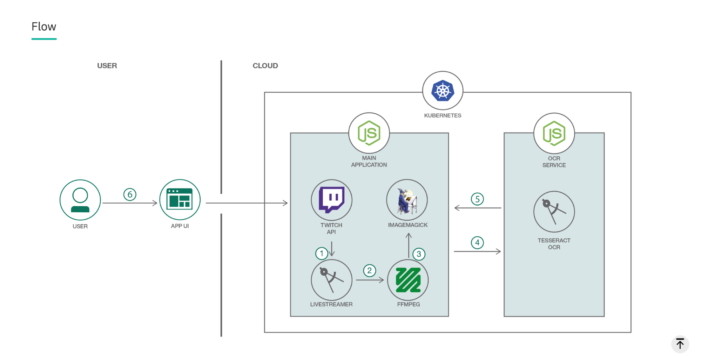

!SLIDE[bg=_images/backgrounds/white_bg.png]

# Application Architecture

!SLIDE[bg=_images/backgrounds/white_bg.png]

# Twitch API Calls

* First, we grab a list of streamers currently streaming PUBG.
* Just a REST API call which returns a JSON payload of streams.
* Twitch's API is a paging API. We just take the first page, though you could
  theoretically page through to get a larger pool of streams if you wanted.
* Filter by English language streams and streams which are not flagged as for
  mature audiences.
* This is just to get stream names, although the API provides a lot of other
  metadata about each stream.

!SLIDE[bg=_images/backgrounds/white_bg.png] code

# Twitch API Calls

    @@@ javascript
    request(options, function(error, response, body) {
      if (body === undefined || body === null) {
        log.error("No response from Twitch.");
        if (error) {
          log.error("  " + error);
        }
        return Array([]);
      }
      if (error) log.error("error:", error);
      log.info("statusCode:", response.statusCode);

      bodyJSON = JSON.parse(body);
      allAgesStreams = bodyJSON.streams.filter(function(d) {
        return d.channel.mature === false;
      });

      usernameList = allAgesStreams.map(function(d) {
        return d.channel["display_name"];
      });
      log.info(usernameList);
      return callback(usernameList);
    });
    end
