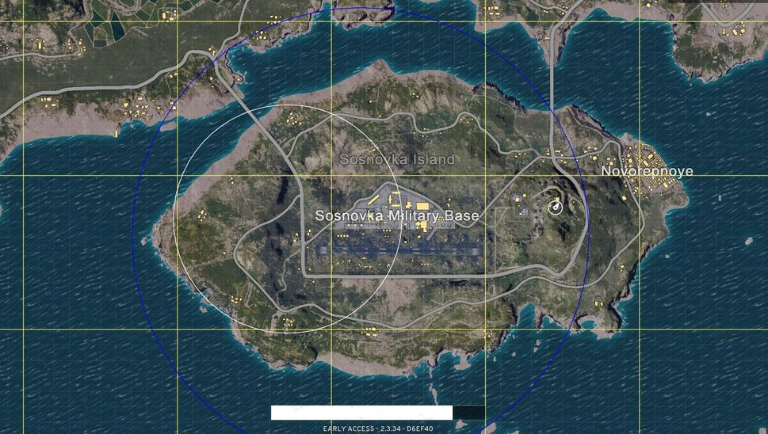

!SLIDE[bg=_images/backgrounds/white_bg.png]

# Basic Mechanics

* Players parachute into island with no gear; must loot buildings for
  randomly-generated gear after landing.
* Can queue solo, duos, or 3/4 person squads.
* Last person standing wins (“Winner Winner Chicken Dinner”) by any means
  possible.
* Permadeath. Once you’re out, you requeue. No respawns.
* Players forced to cluster together by a circle on the map which is constantly
  shrinking. Players outside the circle take damage until death.

!SLIDE[bg=_images/backgrounds/white_bg.png]

# Basic Mechanics (Map)

!SLIDE [bg=_images/backgrounds/white_bg.png]

# Basic Mechanics (Circles)

!SLIDE [bg=_images/backgrounds/white_bg.png]

# Winner Winner Chicken Dinner (and hence, Rotisserie)

